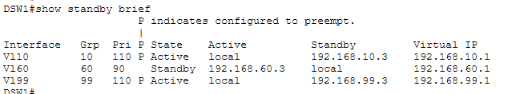
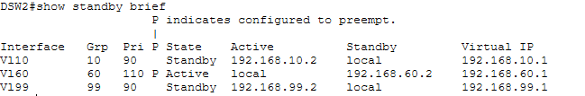
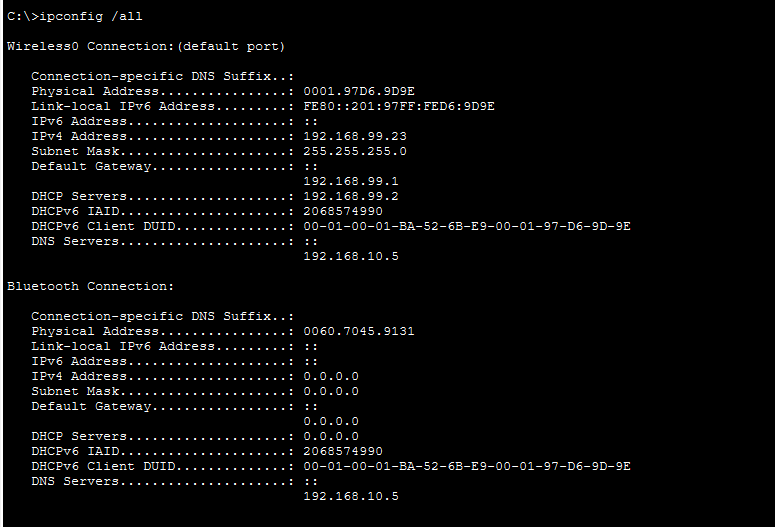
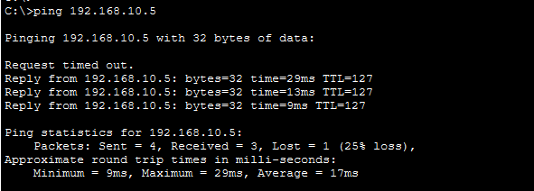
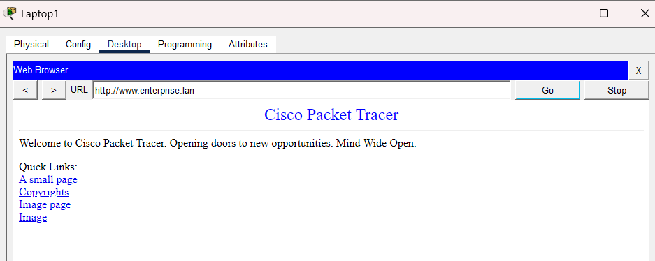

# enterprise-net_lab# Enterprise Campus Network Infrastructure with WLC & High Availability

Triển khai mô hình hạ tầng mạng doanh nghiệp chuẩn quy mô Enterprise Campus trên nền tảng Cisco Packet Tracer, tích hợp định tuyến đa vùng, dự phòng Gateway HSRP và giải pháp quản trị mạng không dây tập trung (Cisco WLC & Lightweight AP).


---

## 📌 Architecture & Subnet Planning

| VLAN ID | Phân vùng mạng | Subnet | Gateway (HSRP VIP) | Active Gateway |
|---|---|---|---|---|
| **VLAN 10** | Enterprise Servers | `192.168.10.0/24` | `192.168.10.1` | DSW1 |
| **VLAN 60** | Wireless Clients | `192.168.60.0/24` | `192.168.60.1` | DSW2 |
| **VLAN 99** | Management Network | `192.168.99.0/24` | `192.168.99.1` | DSW1 |

---

## 🚀 Key Implementations & Troubleshooting Highlights

1. **HSRP Gateway Load Balancing:**
   - **DSW1:** Cấu hình `Priority 110` (Preempt) làm Active Gateway cho VLAN 10 và VLAN 99.
   - **DSW2:** Cấu hình `Priority 110` (Preempt) làm Active Gateway cho VLAN 60.
   - Đảm bảo chia tải lưu lượng giữa 2 Distribution Switch và tự động chuyển đổi dự phòng khi xảy ra sự cố phần cứng.

2. **Centralized Wireless LAN Architecture (WLC):**
   - Chuyển chế độ vận hành WLAN sang **Central switching, central authentication** trên WLC.
   - Luồng lưu lượng không dây từ client được đóng gói CAPWAP qua Access Point về thẳng WLC xử lý tập trung, tránh lỗi mất gói tin broadcast DHCP do switch access drop cục bộ.

3. **Core Services Integration:**
   - Hoàn tất chu trình DHCP DORA qua mô hình mạng trung tâm.
   - Tích hợp dịch vụ phân giải tên miền nội bộ (DNS) và máy chủ web doanh nghiệp (`www.enterprise.lan`).

---

## 📷 Verification & Test Results

### 1. High Availability (HSRP) Verification
Phân chia tải trạng thái Active/Standby giữa hai switch phân phối DSW1 và DSW2:

| DSW1 (`show standby brief`) | DSW2 (`show standby brief`) |
| :---: | :---: |
|  |  |

### 2. Client DHCP Verification
Laptop1 kết nối Wi-Fi thành công, tự động nhận đầy đủ thông số địa chỉ IP, Default Gateway và DNS Server:



### 3. End-to-End Connectivity
Kiểm tra định tuyến Inter-VLAN từ Laptop1 tới máy chủ trung tâm (`192.168.10.5`):



### 4. Application Layer Service Access
Laptop1 phân giải tên miền và tải thành công trang web nội bộ qua giao thức HTTP:



---

## 📂 Repository Structure

```text
├── configs/
│   ├── ASW1.cfg
│   ├── DSW1.cfg
│   ├── DSW2.cfg
│   └── HQ-R1.cfg
├── screenshots/
│   ├── 01_hsrp_dsw1.png
│   ├── 02_hsrp_dsw2.png
│   ├── 03_dhcp_client.png
│   ├── 04_ping_test.png
│   └── 05_web_access.png
├── lab.pkt
└── README.md
